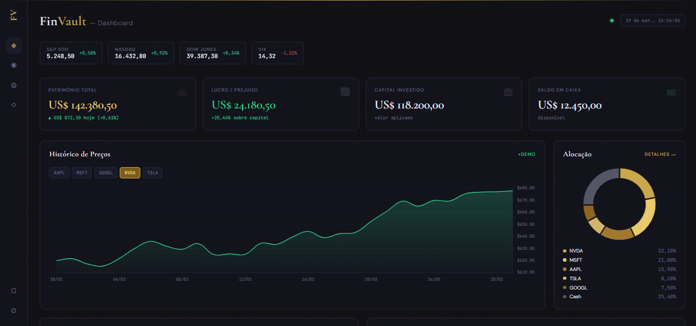

# FinVault

<p align="center">
  Dashboard financeiro para visualização de carteira, desempenho de ativos e indicadores de mercado.
</p>

<p align="center">
  
  
  
  
  
</p>

## Preview



## Sobre o projeto

O **FinVault** é um dashboard financeiro desenvolvido com foco em visualização de dados e integração entre frontend e backend.

A aplicação utiliza um backend em **Flask** com endpoints simulados e uma interface construída com **HTML**, **CSS** e **JavaScript**, exibindo informações como carteira, gráfico de ativos, alocação, principais movimentações do dia, índices de mercado e histórico de transações.

> Este projeto utiliza **dados simulados** para fins de demonstração e portfólio.

## Funcionalidades

- Visão geral da carteira com indicadores principais
- Gráfico de preço por ativo
- Gráfico de alocação da carteira
- Lista de maiores altas e quedas
- Histórico recente de transações
- Barra com índices de mercado
- Tabela de posições da carteira
- Fallback para dados demo quando a API não estiver disponível

## Tecnologias utilizadas

### Backend
- Python
- Flask
- Flask-Cors

### Frontend
- HTML5
- CSS3
- JavaScript
- Chart.js

### Deploy
- Vercel

## Estrutura do projeto

```bash
Dashboard/
├─ app.py
├─ requirements.txt
├─ README.md
├─ preview.png
└─ public/
   ├─ index.html
   ├─ css/
   │  └─ style.css
   └─ js/
      └─ main.js
```

## Como executar localmente

### 1. Clone o repositório

```bash
git clone <URL_DO_SEU_REPOSITORIO>
cd <NOME_DO_SEU_REPOSITORIO>
```

### 2. Crie e ative o ambiente virtual

No Windows PowerShell:

```powershell
python -m venv .venv
.\.venv\Scripts\Activate.ps1
```

### 3. Instale as dependências

```bash
pip install -r requirements.txt
```

### 4. Execute a aplicação

```bash
python app.py
```

Acesse no navegador:

```text
http://localhost:5000
```

## Endpoints da API

- `GET /api/portfolio`
- `GET /api/chart/<ticker>`
- `GET /api/movers`
- `GET /api/indices`
- `GET /api/allocation`
- `GET /api/transactions`

## Deploy

O projeto foi reorganizado para deploy na **Vercel**, com os arquivos estáticos servidos a partir da pasta `public/`.

## Objetivo

Este projeto foi desenvolvido com foco em:

- prática de integração entre frontend e backend
- organização de interface em formato dashboard
- consumo de API
- visualização de dados financeiros
- construção de projeto para portfólio

## Melhorias futuras

- integração com API real do mercado financeiro
- filtros por período no gráfico
- busca de ativos
- exportação de dados
- autenticação de usuário
- responsividade mais refinada
- dados em tempo real

## Autor

Feito por **Wesley Albuquerque** 💻

- GitHub: [wesleyyach](https://github.com/wesleyyach)
- LinkedIn: [wesley albuquerque](https://linkedin.com/in/wesley-albuquerque-7272892b7)

## Licença

Este projeto foi desenvolvido para fins de estudo, demonstração e portfólio.